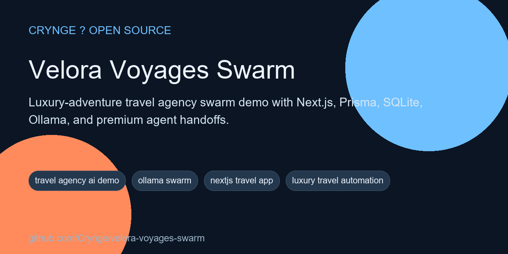
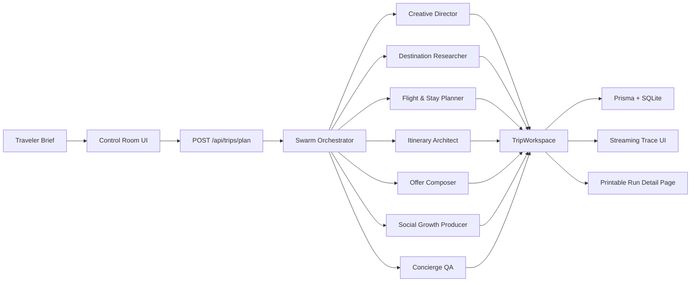

# Velora Voyages Swarm

<!-- portfolio-seo:start -->
  



> Luxury-adventure travel agency swarm demo with Next.js, Prisma, SQLite, Ollama, and premium agent handoffs.

**GitHub Search Keywords:** travel agency ai demo, ollama swarm, nextjs travel app, luxury travel automation, ai itinerary planner, kimi ollama demo, travel agent swarm

<!-- portfolio-seo:end -->

<!-- portfolio-links:start -->
<div align="center">

[Documentation](docs) &middot; [Authors](AUTHORS.md) &middot; [Contributing](CONTRIBUTING.md) &middot; [Security](SECURITY.md) &middot; [Workflows](.github/workflows)

</div>
<!-- portfolio-links:end -->

Luxury-adventure travel agency demo built with Next.js 15, TypeScript, Prisma, SQLite, and Ollama's OpenAI-compatible API.

This repo is designed to feel viral on GitHub for the right reasons:

- A cinematic landing page that sells the concept instantly
- A live control room that streams agent handoffs in real time
- Persistent run history with printable itinerary pages
- Seeded travel briefs so the first demo works fast
- Kimi K2.6 on Ollama by default, with a fallback model and a built-in mock path for no-drama demos

## What It Does

Drop in a premium travel brief and the swarm behaves like a boutique agency team:

1. `Creative Director` sets the taste and tone
2. `Destination Researcher` builds destination intelligence
3. `Flight & Stay Planner` shapes the routing and hotel strategy
4. `Itinerary Architect` turns it into day-by-day flow
5. `Offer Composer` writes the quote and client-facing email
6. `Social Growth Producer` turns the trip into launch-ready content
7. `Concierge QA` pressure-tests the final package

Every specialist writes structured output back into a shared `TripWorkspace`, and the UI streams the trace as it happens.

## Stack

- `Next.js 15`
- `React 19`
- `TypeScript`
- `Tailwind CSS 4`
- `Prisma 7` client
- `SQLite`
- `Ollama` via `http://localhost:11434/v1`
- `OpenAI` SDK against Ollama's compatibility layer

## Quick Start

```bash
cp .env.example .env
npm install
npm run db:setup
npm run dev
```

Then open [http://localhost:3000](http://localhost:3000).

## Ollama Setup

Default model in `.env.example`:

```env
OLLAMA_MODEL="kimi-k2.6:cloud"
OLLAMA_FALLBACK_MODEL="qwen3.5:latest"
```

Recommended setup paths:

### Use Kimi on Ollama Cloud

```bash
ollama signin
```

Once you're signed in locally, the app can call cloud models through `http://localhost:11434/v1`.

### Use a local fallback model

```bash
ollama pull qwen3.5:latest
```

### Demo without live model access

If neither the primary nor fallback model is reachable, the repo can still produce structured demo outputs when:

```env
TRAVEL_SWARM_ALLOW_MOCK_FALLBACK="true"
```

That keeps the control room and run pages demoable while you finish model setup.

## Seeded Scenarios

The repo ships with three demo briefs:

- `Maldives Honeymoon`
- `Kenya + Zanzibar Luxury Adventure`
- `Japan Food-and-Design Escape`

Reset them anytime with:

```bash
curl -X POST http://localhost:3000/api/demo/reset
```

Or use the `Reset Demo` button in the control room.

## API Surface

### `POST /api/trips/plan`

Runs the full multi-agent workflow and streams newline-delimited JSON events back to the client.

### `POST /api/content/campaign`

Returns a saved run's campaign pack.

### `GET /api/health/ollama`

Checks Ollama connectivity and reports the active model.

### `POST /api/demo/reset`

Reseeds the agency profile, demo briefs, and clean demo state.

## Architecture



## Project Shape

```text
src/
  app/
    api/
    control-room/
    runs/[id]/
  components/
  lib/
    swarm/
  types/
prisma/
scripts/
```

## Important Files

- `src/lib/swarm/orchestrator.ts` - end-to-end travel workflow
- `src/lib/ollama.ts` - Ollama adapter and structured model calls
- `src/lib/repository.ts` - Prisma-backed data access
- `src/components/control-room.tsx` - live operator UI
- `src/components/landing-page.tsx` - public GitHub-demo landing page
- `src/app/runs/[id]/page.tsx` - printable itinerary and trace page

## Environment

`.env.example`

```env
DATABASE_URL="file:./dev.db"
OLLAMA_BASE_URL="http://localhost:11434/v1"
OLLAMA_API_KEY=""
OLLAMA_MODEL="kimi-k2.6:cloud"
OLLAMA_FALLBACK_MODEL="qwen3.5:latest"
TRAVEL_SWARM_ALLOW_MOCK_FALLBACK="true"
```

## Scripts

```bash
npm run dev
npm run lint
npm run build
npm run db:push
npm run db:seed
npm run db:setup
npm run db:studio
```

Note: `db:push` bootstraps the local SQLite schema and regenerates Prisma Client. That keeps setup reliable on machines where Prisma's schema-engine binary is temperamental, while Prisma remains the runtime data layer.

## Verification

Verified locally with:

```bash
npm run lint
DATABASE_URL="file:./dev.db" npm run db:setup
DATABASE_URL="file:./dev.db" npm run build
```

On PowerShell, set the environment variable like this:

```powershell
$env:DATABASE_URL='file:./dev.db'
npm run db:setup
npm run build
```

## Demo Story

This repo is strongest when shown in this order:

1. Open the landing page and let the concept sell itself
2. Jump into `/control-room`
3. Load a seeded brief
4. Launch the swarm and narrate the trace
5. Open the completed run page
6. Copy the markdown or export a PDF

That flow makes the project read like a product, not just a model wrapper.
